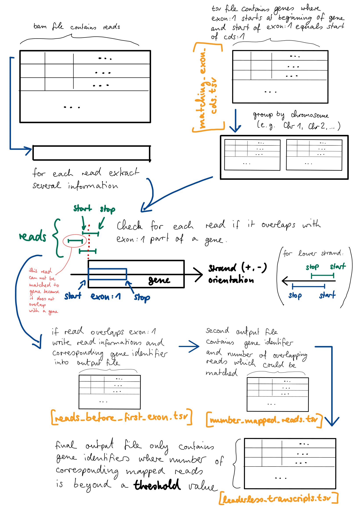

# Leaderless transcription in eukaryotes


# Task 1
For each gene in a given `gff3` file validate if first exon and first CDS have same starting position.
If they have the same starting position, they are written into output file `./output_data/matching_exon_cds.tsv`.
In addition there is a second output file (`./output_data/all_exon.tsv`) which contains positions of exon:1 for each unique gene identifier.

Keep in mind that each gene is located on forward or reverse strand of the DNA sequence.

For the reverse strand the stop position is the wanted start position:

```text
    Start           Stop
----|---------------|---------> (forward)

                    Start           Stop
(reverse) <---------|---------------|----
```

First the given `gff` file is stored as table by using `pandas`. The resulting data frame is grouped by domain name (gene identifier).

Second for each gene identifier subset exon:1 and cds:1 start position depending on strand direction are extracted and then compared.
If they are equal (exon:1 and cds:1 starting at same position) the resulting gene identifier and start position of exon:1 (== cds:1) are written to output file (`./output_data/matching_exon_cds.tsv`).


## corresponding:
code: ./src/map_first_exon_cds.py

input file: gff file (version 3) is provided by course organizers

example entry from given `gff` file:

| ##gff-version   3| | |||||||
| --- | ---| --- | --- | --- | --- | --- | --- | --- |
| Chr1 |	Araport11	| gene |	3631 |	5899 |	. |	+ |	. |	ID=AT1G01010;Name=AT1G01010;Note=NAC domain containing protein 1;symbol=NAC001;some more explanantion ...additional information |

output file: ./output_data/matching_exon_cds.tsv

output file is tab separated and contains following columns (including example entry):

| GeneIdentifier | Chromosome	| Start	| Stop	| Strand|
| --- | --- | --- | --- | --- |
| AT1G01130	| Chr1	| 63811	| 63557 | - |

`GeneIdentifier` is the unique gene identifier (e.g. AT1G01010).
`Chromosome` is the label of corresponding chromosome (e.g. Chr1)
`Start` is an integer value of the start position from exon:1.
`Stop` is an integer value of the stop position from exon:1.
`Strand` is a string which contains its orientation (forward: +, reverse: -).

In addition some statistics are printed (example):
```text
Total number of entries in gff file: 789890
Total number of genes: 69803
Number of matches where start positions are equal (exon:1 == cds:1): 4201
Proportion of genes with matching exon:1 and cds:1: 6.02%
```

# Task 2
To determine if the possible candidates from task 1 (exon:1 == cds:1) are leaderless transcripts
there should not be any reads before exon:1. 
The read data is stored in a binary sam (`bam`) file. The following steps are done by the `map_reads.py` script.
For each read from `bam` file q_name (read identifier), chromosome name (e.g. Chr1), start/stop position and strand orientation are extracted.
In the next step the read has to be mapped to a gene identifier.
This is done by using the results from task 1.
By grouping the results from task 1 by chromosome (e.g. Chr1, Chr2, ...) a subset can be used to determine the corresponding gene for the read.
The start and stop position of the read is used to check if it overlaps with the start position of exon:1 from a possible leaderless transcript candidate gene of the same chromosome.
These candidates are genes where start position of exon:1 and cds:1 are equal and this start is also the beginning of the gene.
If a read overlaps with this start position it is saved in `reads_before_first_exon.tsv` output file and linked to the gene identifier.

After mapping the reads to corresponding gene identifiers the `detect_leaderless_transcripts.py` script is used to find leaderless transcripts.
For each gene identifier the number of mapped reads is counted and saved to `number_mapped_reads.tsv` output file.
By defining a threshold value in the `config.ini` genes are detected as leaderless transcripts if their number of reads is below
the defined threshold value. The gene identifiers of the leaderless transcripts are stored in output file `leaderless_transcripts_threshold_<VALUE>.tsv`.

The workflow process is visualized in the following schematic:



## corresponding:
code: ./src/map_reads.py

input file: bam file (binary sam file) is provided by course organizers

example entry from given `bam` file:
```text
HWI-1KL168:41:H7GWJADXX:2:2113:20686:32469	0	0	3630	255	129M1S	-1	-1	129	AAATTATTAGATATACCAAACCAGAGAAAACAAATACATAATCGGAGAAATACAGATTACAGAGAGCGAGAGAGATCGACGGCGAAGCTCTTTACCCGGAAACCATTGAAATCGGACGGTTTAGTGAAAN	array('B', [30, 31, 31, 26, 33, 33, 35, 35, 27, 34, 32, 39, 37, 40, 33, 38, 38, 38, 39, 37, 36, 37, 35, 37, 37, 36, 39, 34, 38, 36, 37, 32, 32, 35, 35, 38, 39, 39, 31, 29, 30, 30, 27, 35, 31, 30, 37, 39, 40, 40, 23, 30, 19, 34, 32, 34, 37, 38, 31, 34, 19, 28, 28, 31, 38, 36, 32, 36, 32, 27, 28, 24, 32, 28, 32, 26, 34, 33, 33, 29, 33, 25, 33, 33, 29, 27, 27, 27, 29, 32, 25, 32, 34, 34, 34, 34, 34, 34, 24, 20, 27, 20, 30, 32, 33, 34, 34, 34, 18, 31, 32, 29, 31, 30, 33, 27, 33, 33, 33, 20, 27, 33, 34, 34, 19, 31, 29, 25, 18, 29])	[('NH', 1), ('HI', 1), ('AS', 127), ('nM', 0)]
```

output file: output_data/reads_before_first_exon.tsv

output file is tab separated and contains following columns (including example entry):

|GeneIdentifier|	Start_exon_1|	Read_QNAME|	Read_START|
| --- | --- | --- | --- |
|AT1G02350	|469971|	HWI-1KL168:41:H7GWJADXX:1:2213:12707:54616|	469720|

`GeneIdentifier` is the unique gene identifier (e.g AT1G01010).
`Start_exon_1` is an integer value of the starting position from exon:1.
`Read_QNAME` is a string which contains the unique identifier of a single read from `bam` file.
`Read_START` is an integer value of the starting position from specific read.

code: ./src/detect_leaderless_transcripts.py

input file: output_data/reads_before_first_exon.tsv is created by previous script.

first output file: output_data/number_mapped_reads.tsv

first output file is tab separated and contains following columns (including example entry):

|GeneIdentifier|	Number_mapped_reads|
| --- | --- |
|AT1G02350|	16|

`GeneIdentifier` is the unique gene identifier (e.g AT1G01010).
`Number_mapped_reads` is the number of reads which are overlapping exon:1 start position of corresponding gene.

second output file: output_data/leaderless_transcripts_threshold_<VALUE>.tsv
The <VALUE> is placeholder and represents the threshold value defined in `config.ini`.

second output file is tab separated and contains gene identifiers of genes which are detected as leaderless transcripts
It has following columns (including example entry):

|GeneIdentifier|
| --- |
|AT1G05005|

`GeneIdentifier` is the unique gene identifier (e.g AT1G01010).

# Preparation
Code is written in Python 3.7.4. Required python packages are:
* pandas==1.0.1
* pysam == 0.15.4

Install all requirements easily by using pip and the given [requirements.txt](./requirements.txt):
```shell script
pip install -r ./requirements.txt
```

# How to use
Adjust settings in `./config.ini` by setting path to data files and select whether code should be executed in `DEBUG` mode.
The debug mode enables multiple prints in the python scripts (e.g. show each row from bam file before processing).
Because it slows down the processing speed debug mode should only be enabled if the results are not as expected.
The threshold value is used while detecting leaderless transcripts. Genes are marked as leaderless transcripts if number
of mapped reads overlapping exon:1 are below threshold value.
```text
[DATA_PATH]
path = /your/path/to/project/data/files

[DEBUG_MODE]
debug = False

[DETECTION]
threshold = 4
```
`path` defines the path to folder which contains `gff` and `bam` data file.
`debug` is a boolean value (True/False).
`threshold` defines the maximum number of allowed mapped reads for a gene identifier. 
In this example all genes considered as leaderless transcripts if 4 or less reads can be mapped to the gene.


## Execute task 1:
```shell_script
python3 ./src/map_first_exon_cds.py
```
After execution resulting output can be found in `./output_data/matching_exon_cds.tsv`.

## Execute task 2:
```shell_script
python3 ./src/map_reads.py
python3 ./src/detect_leaderless_transcripts.py
```
After execution of `map_reads.py` resulting output can be found in `./output_data/reads_before_first_exon.tsv`.
After execution of `detect_leaderless_transcripts.py` resulting output files are
`./output_data/number_mapped_reads.tsv` and `./output_data/leaderless_transcripts_threshold_<VALUE>.tsv`.
Because `bam` can be really large (~20GB) execution will take a long time (~10h) depending on your system specifications.

# Links
* [explanation of BAM/SAM files](https://samtools.github.io/hts-specs/SAMv1.pdf)
* [pysam Documentation](https://pysam.readthedocs.io/en/latest/index.html)
* [pandas documentation](https://pandas.pydata.org/pandas-docs/stable/user_guide/index.html#user-guide)