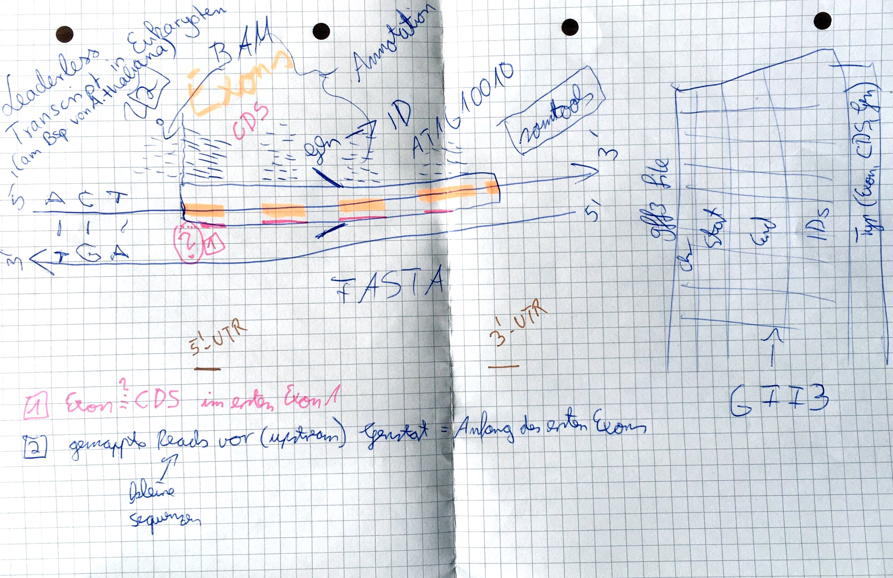

# Leaderless transcription in eukaryotes


# Task 1
For each gene in a given `gff3` file validate if first exon and first CDS have same starting position.
If they have the same starting position, they are returned as list in an output file.
Keep in mind that each gene is located on upper or lower strand of the DNA sequence. For the lower strand the stop position is the wanted start position.

## corresponding:
code: src/map_first_exon_cds.py
file: gff file (version 3) is provided by course organizers
example entry:
```text
##gff-version   3
Chr1	Araport11	gene	3631	5899	.	+	.	ID=AT1G01010;Name=AT1G01010;Note=NAC domain containing protein 1;symbol=NAC001;some more explanantion ...additional information
```


# Task 2
Validate if mapped reads overlap position of first exon in a way they start before the first exon position.

## corresponding:
code: TODO
file: bam file is provided by course organizers
